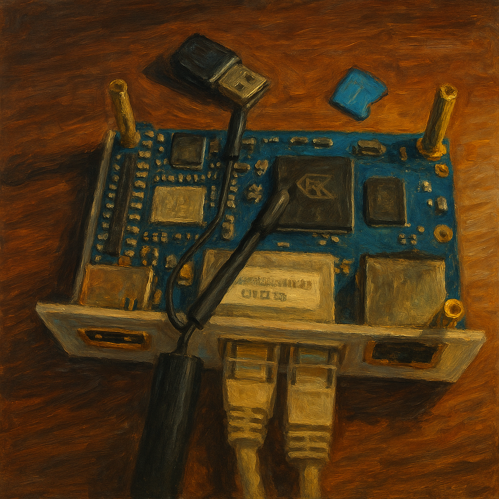

# Minimal home WiFi/wired router @ Orange Pi RV2 SBC



Fast and simple way to make your [Orange Pi RV2](http://www.orangepi.org/orangepiwiki/index.php/Orange_Pi_RV2) SBC device as a home WiFi and wired router running on [Irradium OS](https://irradium.org/) (based on `CRUX` distribution), in few steps. Fully functional, secure by default, and suitable for internet exposure.

## Installation

1. Prepare image by single command:
   ```shell
   ./build.sh
   ```

   Alternatively, you can customize your SSID and WiFi password as:
   ```shell
   WIFI_SSID="MyRouter" WIFI_PASSWORD="SuperSecret!" ./build.sh
   ```

1. Format 16GB+ SD Card and burn image generated above by next one-liner:
   ```shell
   mintstick -m format && mintstick -m iso -i irradium-opi-router.img && sync
   ```

1. Insert SD Card into SBC.

   Connect your computer to the left from top Ethernet port (`eth1`, LAN: `192.168.10.1`).

   Connect your ISP modem to the right from top Ethernet port (`eth0`, WAN).

   Power on.

1. Wired clients require static IP configuration.

   On your host configure `DHCP` manually.
   * Under `Network Manager`:
     * Method: *Manual*,
     * Address: *192.168.10.10*,
     * Netmask: *24*,
     * Gateway: *192.168.10.1*,
     * DNS: *192.168.10.1,8.8.8.8*.

   * Or, just from CLI (my example below):
   ```shell
   sudo ip addr add 192.168.10.10/24 dev enp130s0         # set static IP in LAN subnet
   sudo ip route add default via 192.168.10.1             # set SBC as a default gateway
   echo "nameserver 8.8.8.8" | sudo tee /etc/resolv.conf  # set DNS
   ```

   WiFi clients receive IP, gateway, and DNS automatically via `DHCP`.

1. Now you can always SSH to your new `Orange Pi RV2` router from host box without password (key-only auth):
    ```shell
    ssh root@192.168.10.1
    ```

1. Auto-login without password with using `minicom` and USB-to-Serial converter (PL2303):
   ```shell
   sudo minicom --baudrate 115200 --device /dev/ttyUSB0
   ```

1. Now all devices (as wired PC behind `eth1` LAN as all WiFi devices connected to `wlan0` via WiFi) are in one logical LAN under 192.168.10.0/24 network segment because `br0` bridge, and might be connected to each other (WiFi <-> wired, WiFi <-> WiFi, wired <-> wired).

   Done!

## License

MIT license ([LICENSE](https://github.com/vitali2y/simple-opirv2-router/blob/main/LICENSE) or <http://opensource.org/licenses/MIT>)
